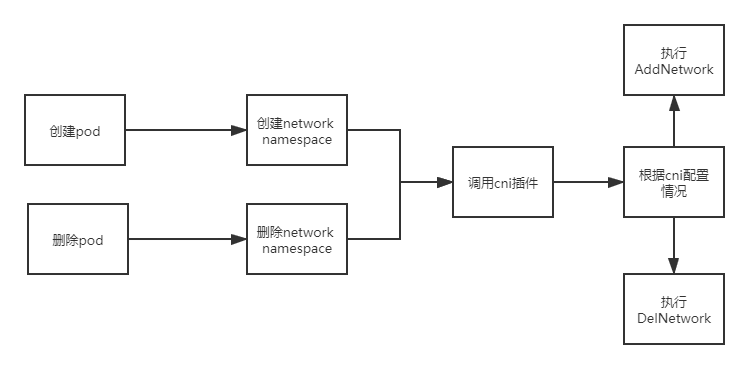
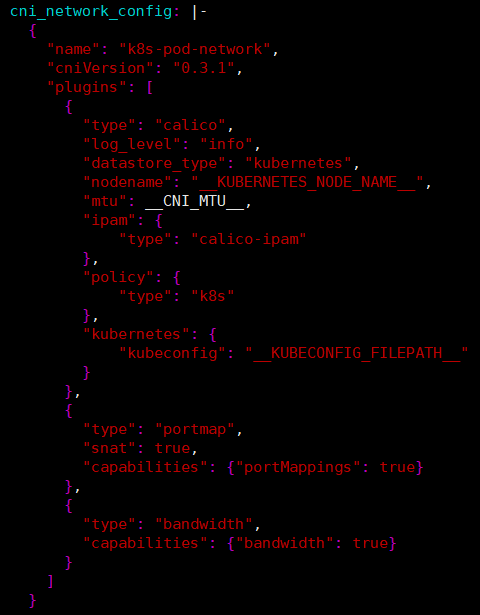
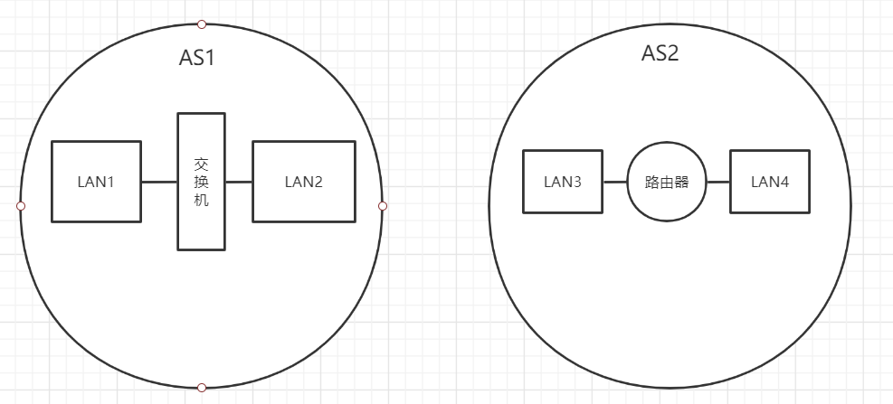
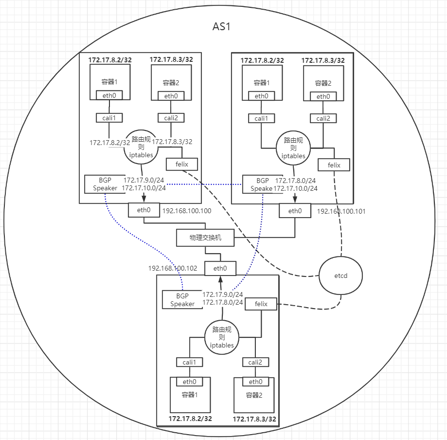
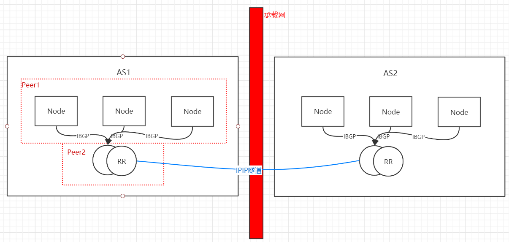

# calico部署实践

## 1. cni
#### 首先我们要知道cni是个什么，它到底在pod启动的过程中有什么作用。

CNI是Container Network Interface的是一个标准的，通用的接口，用于连接容器管理系统和网络插件。

其基本思想为：Container Runtime在创建pod容器时，先创建好network namespace，然后调用CNI插件，根据这个cni配置为这个netns执行插件ADD方法，配置网络，其后再启动容器内的进程。



CNI插件包括两部分：

- CNI Plugin负责给容器配置网络，它包括两个基本的接口
    - 配置网络: AddNetwork(net NetworkConfig, rt RuntimeConf) (types.Result, error)
    - 清理网络: DelNetwork(net NetworkConfig, rt RuntimeConf) error

- IPAM Plugin负责给容器分配IP地址，主要实现包括host-local和dhcp。

CNI插件是可执行文件，会被kubelet调用。启动kubelet –network-plugin=cni，–cni-conf-dir指定networkconfig配置，默认路径是：/etc/cni/net.d，并且，–cni-bin-dir指定plugin可执行文件路径，默认路径是：/opt/cni/bin。

#### 其次，我们要知道一个pod启动过程中需要经历哪些步骤。

Kubernetes Pod 中的其他容器都使用Pod所属pause容器的网络，创建过程为：

- kubelet 先创建pause容器生成network namespace
- 调用网络CNI driver
- CNI driver 根据配置调用具体的cni 插件
- cni 插件给pause 容器配置网络
- pod 中其他的容器都使用 pause 容器的网络

#### 重要的是，我们最终需要知道calico这个cni插件在启动过程中，到底需要经历哪些步骤。

## 2. caclico-node的创建过程
我们都知道，一个pod中的所有容器共享使用该pause容器的网络栈，pause容器从网络栈的ip段分配ip给pod，并且让pod下的容器ip和pod ip端口进行对接。


节点在未部署网络插件的情况下会处于notReady的状态。
- 当我们通过calico.yaml部署的时候，首先在节点上会启动calico的pause容器，该pause容器通过calico的配置文件注入cni配置信息；



- 然后，对于calico-node的启动，首先会启动init容器，该容器中包括：upgrade-ipam，install-cni，flexvol-driver这三个容器：
    - 其中upgrade-ipam主要负责更新节点ipam，通过获取节点上ipam的信息，来进行更新；
    - install-cni主要负责将cni配置信息写入节点机子上，保存集群的信息到host/etc/cni/net.d/calico-kubeconfig文件下，该文件储存calico访问api server的信息，包括master的地址，ca证书信息和token信息；
    - flexvol-driver主要负责felix的socket和api server的socket交互稳定，底层是一种FlexVolumes的驱动，用来保障Pods和守护进程的安全通信；


- 以上三个容器在启动后会自动退出，并不会持久存在。最重要的两个容器就是calico-node和calico-kube-controller：
    - calico-node其实就是将所有组件进行了打包到一个项目中进行管理。calico-node 使用了 runit 进行进程管理， 简单说就是entrypoint 中将需要运行的应用拷贝到 /etc/service/enable 目录下， 当runsvdir检查应用时，runsvdir 会启动一个 runsv 进程来执行和监控run脚本。calico-node中主要运行这三个应用：
        - felix主要管理网络规则：
            -  felix可以通过calc计算平面获取信息，发给dataplane数据平面编写路由信息到rule规则中；
            -  felix管理calico的所有网络接口，将有关接口的信息编程到内核中去，使得内核能够正确处理该endpoint发出的流量；
        - bird主要是用于bgp广播。
            - bird通过读取felix在数据平面内分发的路由信息执行路由信息分发。
            - 通过/node/bird/bird.go的源码分析可以看到其通过区分bgp网络类型来和bgp peer进行socket通信；
        - confd主要用于监听bgp的信息变化，通过etcd或者kubernetes api上的状态信息，不断sync（watchProcessor实例化进程）监听felix上的路由更新信息，一旦发现更新了，则启动reload更新BIRD配置；
    - calico-kube-controller主要负责对节点和calico的数据管理；
      
        - quay.io/calico/kube-controllers容器包含以下控制器：
          
          - policy controller：监视网络策略和编程Calico策略，它会把Kubernetes的network policies同步到Calico datastore中，该控制器需要有访问Kubernetes API的只读权限，以监听NetworkPolicy事件。 用户在k8s集群中设置了Pod的Network Policy之后，calico-kube-controllers就会自动通知各个Node上的calico-node服务，在宿主机上设置相应的iptables规则，完成Pod间网络访问策略的设置。
          - namespace controller：监视命名空间和编程Calico配置文件，它会把Kubernetes的namespace label变化同步到Calico datastore中，该控制器需要有访问Kubernetes API的只读权限，以监听Namespace事件。
          - serviceaccount controller：监视服务帐户和编程Calico配置文件，它会把Kubernetes的service account变化同步到Calico datastore中，该控制器需要有访问Kubernetes API的只读权限，以监听ServiceAccount事件。
          - workloadendpoint controller：监视pod标签的更改并更新Calico工作负载中的endpoints配置，它会把Kubernetes的pod label变化同步到Calico datastore中，该控制器需要有访问Kubernetes API的只读权限，以监听Pod事件。
          - node controller：监视删除Kubernetes nodes节点的操作并从Calico中也删除相应的数据，该控制器需要有访问Kubernetes API的只读权限，以监听Node事件。
        - 注：
          - 除node controller外，其它功能的控制器均是默认启用的。但是如果你直接使用Calico提供的manifest部署 calico-kube-controllers容器，则仍然是通过配置ENABLED_CONTROLLERS选项打开了node controller控制器。启用node controller控制器，还需要配置第二个地方，就是在calico-node daemon set的manifest文件中需要添加一个环境变量CALICO_K8S_NODE_REF，取值为spec.nodeName 。
          - 以上所有的控制器都是仅在使用etcd作为Calico数据存储区时才有效。
          - 该容器只能存在一个容器实例。
          - 该容器必须在宿主机网络的命名空间中运行（hostNetwork: true），以使其不受容器网络访问控制策略的阻止。
        

当calico-kube-controller和calico-node这两个容器成功部署后，节点calico才算成功部署。


## 3. calico部署多套cni

### 3.1 Calico-BGP介绍
BGP是一种路径矢量协议（Path vector protocol）的实现。因此，它的工作原理也是基于路径矢量（区别于RIF和OSPF）。关于BGP的具体定义，可以看后面一篇关于BGP的介绍。

#### AS(自治系统)
AS是一个自治的网络，拥有独立的交换机、路由器等，可以独立运转。



比如说AS1下的网络状况是LAN1和LAN2通过交换机互联，而AS2下的网络状况是LAN3和LAN4通过路由器进行互联。前者在二层网络互通，后者三层网络互通。

#### BGP Speaker(BIRD)
AS内部有多个BGP speaker，而BGP的通信协议分为ibgp、ebgp，ebgp与其它AS中的ebgp（跨网段）建立BGP连接。

AS内部的BGP speaker通过BGP协议交换路由信息，最终每一个BGP speaker拥有整个AS的路由信息。BGP speaker一般是网络中的物理路由器，可以形象的理解为:

- calico将node改造成了一个软路由器（通过软路由软件bird)
- node上的运行的虚拟机或者容器通过node与外部沟通


这张图上可以看到三个节点的BGP Speaker互相连接，交换路由信息。

#### BGP Peer 和 BGP Router Reflector
BGPPeer可以指定所有Calico节点都应该具有某些对等体，或者只与一个特定的Calico节点建立对等，再或者与指定标签选择器匹配的一组Calico节点都建立对等。

RR模式，就是在网络中指定一个或多个BGP Speaker作为Router Reflection，RR与所有的BGP Speaker建立BGP连接。

每个BGP Speaker只需要与RR交换路由信息，就可以得到全网路由信息。

RR则必须与所有的BGP Speaker建立BGP连接，以保证能够得到全网路由信息。

每个BGP router reflector在收到了peer传来的路由信息，会存储在自己的数据库，前面说过，路由信息包含很多其他的信息，BGP router reflector会根据自己本地的policy结合路由信息中的内容判断，如果路由信息符合本地policy，BGP router reflector会修改自己的主路由表。

本地的policy可以有很多，举个例子，如果BGP router reflector收到两条路由信息，目的网络一样，但是路径不一样，一个是AS1->AS3->AS5，另一个是AS1->AS2，如果没有其他的特殊policy，BGP router reflector会选用AS1->AS2这条路由信息。policy还有很多其他的，可以实现复杂的控制。

下图简单模拟了BGP RR通过calico ip-ip模式跨网段交互的过程：




#### IPPool
一个IP Pool Resource表示calico指定设置endpoint ip地址的网段。默认是192.168.0.0/16，在该ippool下创建的pod ip将会从这个地址段分配。


### 3.2 多套cni实现

在了解了以上概念之后，我们就来实现多套cni的实现。

#### 首先需要配置bgpconfig
在配置bgpconfig之前，需要查看是否有存在默认的bgpconfig配置，通过：

```
calicoctl get bgpconfig default
```
这条命令来查看。

如果没有，则通过下面的配置来生成：

```
apiVersion: crd.projectcalico.org/v1
kind: BGPConfiguration
metadata:
  name: default
spec:
  logSeverityScreen: Info
  nodeToNodeMeshEnabled: false
  asNumber: 63400
```
生成default的bgpconfi，关闭默认的全连接模式，并且设定AS为63400.

#### 然后配置BGP Peer

这里配置两个BGP Peer:

```
apiVersion: crd.projectcalico.org/v1
kind: BGPPeer
metadata:
  name: peer1
spec:
  nodeSelector: calico == '1'
  peerSelector: calico == '1'
```

```
apiVersion: crd.projectcalico.org/v1
kind: BGPPeer
metadata:
  name: peer2
spec:
  nodeSelector: calico == '2'
  peerSelector: calico == '2'
```

这里的nodeSelector和peerSelector在这里简化处理了，在RR模式下将会是不同的配置要求。这里的意思是，peer1对等体选择calico=1这个标签的node，并且将这些node作为对等体。同理peer2。在同一个BGP Peer下的节点能够获取到每一个BGP Speaker的路由信息，能够使得pod互通。不同的BGP Peer下因为无法获得路由配置规则，所以pod无法互通，只能node互通。

#### IPPool模式
在peer1下配置BGP模式的ippool，在peer2下配置IPIP模式的ippool，即可完成两套cni的部署。


```
apiVersion: crd.projectcalico.org/v1
kind: IPPoolList
items:
- apiVersion: crd.projectcalico.org/v1
  kind: IPPool
  metadata:
    name: ippool1
  spec:
    blockSize: 26
    cidr: 192.168.0.0/16
    ipipMode: Never
    natOutgoing: true
    nodeSelector: calico == "1"
    disable: false
```


```
apiVersion: crd.projectcalico.org/v1
kind: IPPoolList
items:
- apiVersion: crd.projectcalico.org/v1
  kind: IPPool
  metadata:
    name: ippool2
  spec:
    blockSize: 26
    cidr: 172.10.0.0/16
    ipipMode: Always
    natOutgoing: true
    nodeSelector: calico == "2"
    disable: false
```

#### 解释
对于ippool1，选择calico=1这个标签下的所有节点，设置的ipipMode=Never意味着启用bgp模式。对于ippool2，选择calico=2这个标签下的所有节点，设置ipipMode=Always表示启用ipip模式。

对等体peer1选择calico=1的所有节点，设置并设置为BGP peer，同理peer2。这样peer1中的每个节点下的bird下都获取到了calico=1下节点的路由信息，通过felix下的iptables进行流量通信。因为peer2与peer1并不对等，所以peer1下的felix无法获取到peer2下的节点路由信息，故对于peer1下的pod无法通过ipatbles访问peer2下的pod。


参考资料：

https://mp.weixin.qq.com/s/ttNuwQyshOVZw5w4mDaR3A
https://zhuanlan.zhihu.com/p/25433049
https://docs.projectcalico.org/
https://blog.csdn.net/watermelonbig/article/details/84981945?depth_1-utm_source=distribute.pc_relevant_right.none-task&utm_source=distribute.pc_relevant_right.none-task
https://cloud.tencent.com/developer/article/1482739
https://feisky.gitbooks.io/sdn/container/calico/


